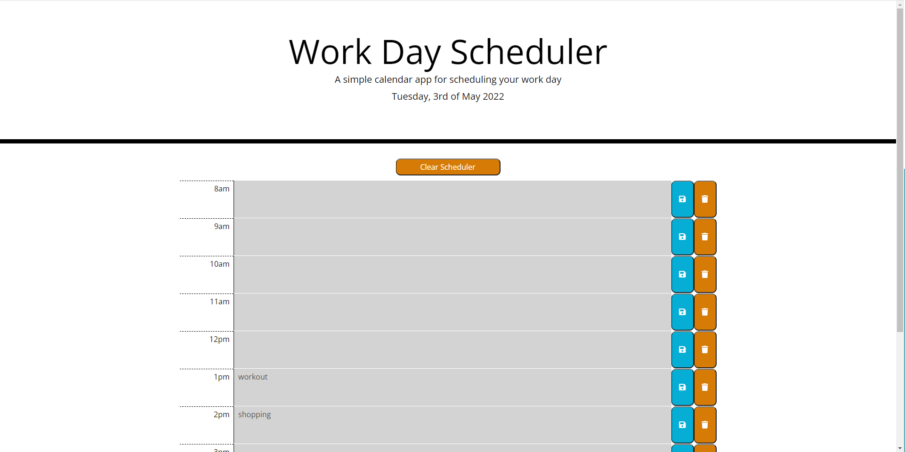
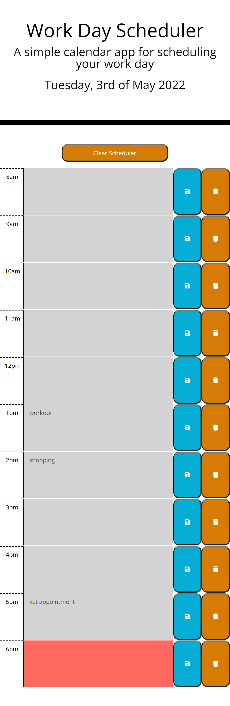

# Day-planner

This project is to develop a simple page where the user can add some tasks at specific hours of the day, save them (persistent data), edit them or even remove them.

Deployed URL:

Github repository:

## General description of the page

When accessing the page, the user can see a large header with title and the current date. Underneath is a set of time blocks which represent a working day. Each time block consists of a time label on the left, a text field in the middle where the user can enter a task, two buttons on the right to save the task in the text field or remove it from the text field.
The user also has the option to clear all text fields in the schedule by clicking on the "Clear Schedule" button located just above the time blocks.

The text fields in the timeblocks are colour coded based on the current time:

- grey: for hours of the day that have already passed
- red: for the current hour
- green: for the remaining hours in the working day

## Screenshot of the page

Day planner screenshot - desktop version

Day planner screenshot - mobile version

## Technologies

## Steps taken to develop the page

## Further improvements possible

General notes:

Add event for each hour of the day?
How many hours do we want? (9AM-5PM)
Use jQuery
Can use Bootstrap
Use moment js https://cdnjs.com/libraries/moment.js
ONLY FOR THE CURRENT DAY

User Journey

- On page load the current day should be displayed on the page (Friday, 29th April, 2022)
- Use moment js format method to format your date
  https://momentjs.com/docs/#/displaying/format/

- On page load all working hours timeblocks should render

- As a user when I type in the event for a specific time and click on the save button for that time then the event is stored in LS

Timeblock

- label (2PM or 14:00 or 14)
- textarea for your notes
- button to save the note in LS
- colour coded (past: grey | present: red | future: green)

When the user loads the page get the current hour using moment js
For each time block when you create the timeblock compare the hour with the current hour
