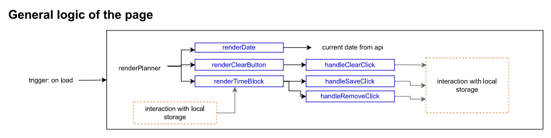
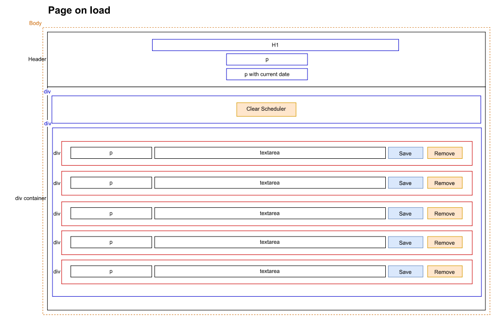
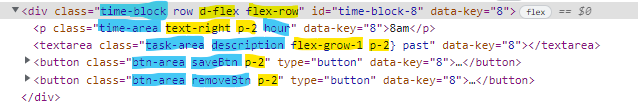

# Day-planner

This project is to develop a simple page where the user can add some tasks at specific hours of the day, save them (persistent data), edit them or even remove them.

Deployed URL: [https://am0031.github.io/day-planner/](https://am0031.github.io/day-planner/)

Github repository: [https://github.com/Am0031/day-planner](https://github.com/Am0031/day-planner)

## General description of the page

When accessing the page, the user can see a large header with title and the current date. Underneath is a set of time blocks which represent a working day. Each time block consists of a time label on the left, a text field in the middle where the user can enter a task, two buttons on the right to save the task in the text field or remove it from the text field.
The user also has the option to clear all text fields in the schedule by clicking on the "Clear Schedule" button located just above the time blocks.

The text fields in the timeblocks are colour coded based on the current time:

- grey: for hours of the day that have already passed
- red: for the current hour
- green: for the remaining hours in the working day

## Screenshot of the page

<details>
<summary>Day planner screenshot - desktop version</summary>


</details>

<details>
<summary>Day planner screenshot - mobile version</summary>


</details>

## Technologies

For this project, the following technologies and libraries were used:

- HTML, CSS and JS files for file structure
- [Bootstrap](https://getbootstrap.com/docs/4.0/getting-started/introduction/) for page styling
- [Fontawesome](https://fontawesome.com/search?s=solid%2Cbrands) for use of icons
- [Moment.js](https://momentjs.com/docs/#/displaying/format/) for use of date and time stamp
- [jQuery](https://jquery.com/) for use in writing JS functionalities

## Steps taken to develop the page

The following steps were followed as listed to develop this project, and are further details in the sections below:

- have a clear understanding of the functionalities the page will offer
- set the wireframe of the project for a clear view of the required html structure
- set the files structure as per best practices and insert up to date library links
- style page with CSS/Bootstrap
- add functionality using jQuery library and interact with local storage (for persistent data)
- refactore for clean code

## General functionalities of the page

The user journey is explained above in the section **General description**.
When looking at it in terms of functions, this can be translated into the following logic:



## Wireframe for the project



Note: the divs shown in red represent a time block. Each time block contains: a p tag on the left displaying the hour for this time block, a text field for user input, two buttons for saving the user input or deleting it. The number of time blocks to display matches the number of working hours defines in our workingHours array.

## Links to libraries

For this project we used the following versions of the libraries mentioned above:

<details>
<summary>Head link - Bootstrap</summary>

```html
<!--Link to Bootstrap api-->
<link
  rel="stylesheet"
  href="https://cdnjs.cloudflare.com/ajax/libs/bootstrap/4.6.1/css/bootstrap.min.css"
/>
```

</details>

<details>
<summary>Head link - Fontawesome</summary>

```html
<!--Link to fontawesome api-->
<link
  rel="stylesheet"
  href="https://cdnjs.cloudflare.com/ajax/libs/font-awesome/6.1.1/css/all.min.css"
  crossorigin="anonymous"
/>
```

</details>

<details>
<summary>Head link - Google fonts</summary>

```html
<!--Link to Google fonts-->
<link
  href="https://fonts.googleapis.com/css?family=Open+Sans&display=swap"
  rel="stylesheet"
/>
```

</details>

<details>
<summary>Body link - jQuery</summary>

```html
<!--Link to jquery api-->
<script
  src="https://code.jquery.com/jquery-3.6.0.js"
  integrity="sha256-H+K7U5CnXl1h5ywQfKtSj8PCmoN9aaq30gDh27Xc0jk="
  crossorigin="anonymous"
></script>
```

</details>

<details>
<summary>Body link - moment.js</summary>

```html
<!--Link to moment js api-->
<script src="https://cdnjs.cloudflare.com/ajax/libs/moment.js/2.29.3/moment.min.js"></script>
```

</details>

## Styling with CSS and Bootstrap

Styling of the page is a combination of a local CSS file and the use of some bootstrap classes:

- in CSS author file : general styling of the body, header, buttons and use of hover pseudo class, media query for mobile screen
- via bootstrap classes: flex properties of containers and alignment of items
  The example below shows how each element of the time block has a mixture of author classes <span style="color:blue">(in blue)</span> and bootstrap classes <span style="color:yellow">(in yellow)</span> depending on the style required:



## Using jQuery

For this page, the creating of elements and interaction with them was done using jQuery. See below a few snippets of the JS code as examples:

<details>
<summary>jQuery syntax for creating page elements and appending them to a container</summary>

```javascript
$("#container").append(
  $("<div>")
    .addClass("clear-block d-flex flex-row justify-content-center")
    .append(
      $("<button>")
        .addClass("clearBtn p-2")
        .attr("type", "button")
        .html("Clear Scheduler")
        .click(handleClearClick)
    )
);
```

</details>

<details>
<summary>jQuery syntax for targeting a specific element and adding a class to an element</summary>

```javascript
$(`textarea[data-key=${each.key}]`).addClass(() => {...});
```

</details>

<details>
<summary>jQuery syntax for getting an element's attribute's value</summary>

```javascript
const targetKey = $(event.target).attr("data-key");
```

</details>
<details>
<summary>jQuery syntax for targeting a specific element and getting its value</summary>

```javascript
const taskValue = $(`textarea[data-key=${targetKey}]`).val();
```

</details>

## Further improvements possible

As this page only offers storage of the tasks to local storage, the natural next step would be of course to rework it by adding external storage.
