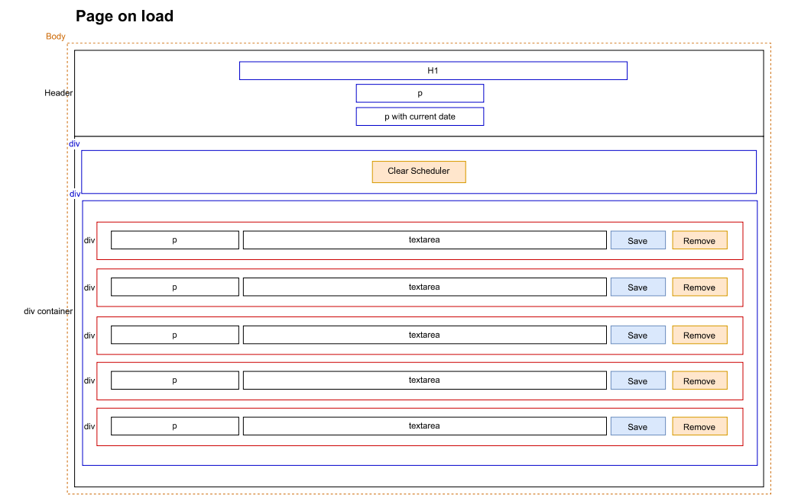
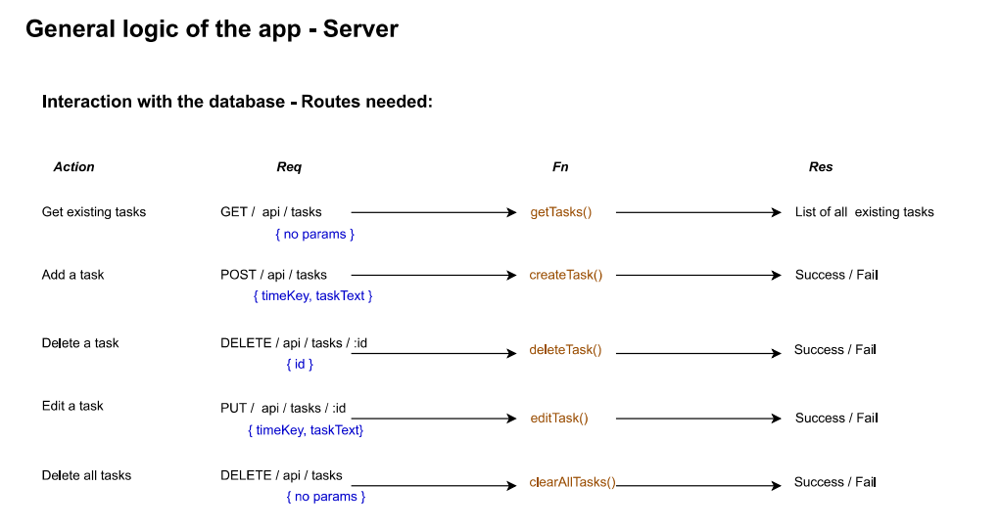
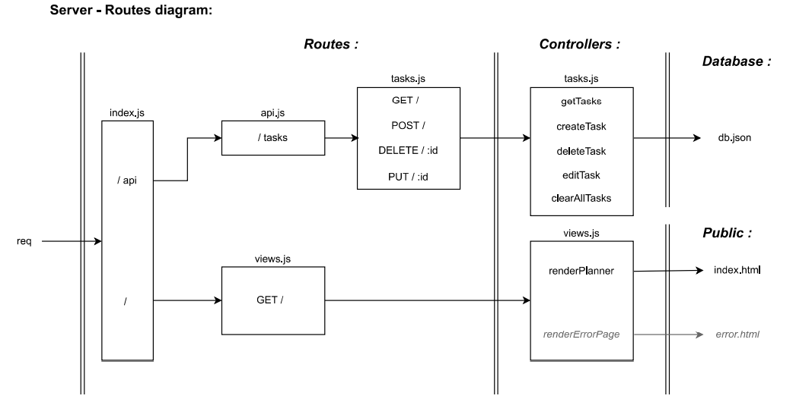
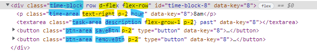

# Day-planner

## Summary

This project is to develop a simple page where the user can add some tasks at specific hours of the day, save them, edit them or even remove them.

Deployed URL: [Heroku page](https://afternoon-crag-21477.herokuapp.com/)

Github repository: [day-planner repo](https://github.com/Am0031/day-planner)

## Table of content

- [General description](#general-description)
- [Screenshots](#screenshots)
- [Technologies](#technologies)
- [Development steps](#development-steps)
- [Wireframe](#wireframe)
- [Functionalities](#functionalities)
- [Links to libraries](#links-to-libraries)
- [Further improvements possible](#further-improvements-possible)

## General description

When accessing the page, the user can see a large header with title and the current date. Underneath is a set of time blocks which represent a working day. Each time block consists of a time label on the left, a text field in the middle where the user can enter a task, two buttons on the right to save the task in the text field or remove it from the text field.

The text fields in the timeblocks are colour coded based on the current time:

- grey: for hours of the day that have already passed
- red: for the current hour
- green: for the remaining hours in the working day

The user also has access to a database to keep track of their tasks. When interacting with the page, the user can:

- save their task with the blue save button in each time block
- clear one specific task with the orange remove button in each time block
- clear the complete scheduler with the orange button "clear scheduler" above the time blocks

## Screenshots

<details>
<summary>Day planner screenshot - desktop version</summary>


</details>

<details>
<summary>Day planner screenshot - mobile version</summary>


</details>

## Technologies

For this project, the following technologies and libraries were used:

For public file structure:

- HTML, CSS and JS files
- [Bootstrap](https://getbootstrap.com/docs/4.0/getting-started/introduction/) for page styling
- [Fontawesome](https://fontawesome.com/search?s=solid%2Cbrands) for use of icons
- [Moment.js](https://momentjs.com/docs/#/displaying/format/) for use of date and time stamp
- [jQuery](https://jquery.com/) for use in writing JS functionalities

For the source file structure and database:

- [Node.js](https://nodejs.org/en/) with npm and the packages:
  - [Express](https://www.npmjs.com/package/express) for server setup
  - [mysql2](https://www.npmjs.com/package/mysql2) for database
  - [dotenv](https://www.npmjs.com/package/dotenv) for sensitive data control
  - [nodemon](https://www.npmjs.com/package/nodemon) for the development phase

## Development steps

The following steps were followed as listed to develop this project, and are further details in the sections below:

First pass:

- have a clear understanding of the functionalities the page will offer
- set the wireframe of the project for a clear view of the required html structure
- set the files structure as per best practices and insert up to date library links
- style page with CSS/Bootstrap
- add functionality using jQuery library and interact with local storage (for persistent data)
- refactore for clean code

Second pass - addition of server and database:

- initialise the app for use with node/npm packages
- reorganise folders and files to build routes
- prepare mysql database with schema and seed files
- deploy on Heroku

## Wireframe



## Functionalities

The user journey is explained above in the section **General description**.
When looking at it in terms of functions, this can be translated into the following logic:


The routes needed for interaction with the database are detailed below:



As a result, the structure of the server was built as per this illustration:



## Links to libraries

For this project we used the following versions of the libraries mentioned above:

```
Node.js: 18.2.0
NPM: 8.9.0
```

NPM packages:

```

"dotenv": "^16.0.1",
"express": "^4.18.1",
"mysql2": "^2.3.3",
"nodemon": "^2.0.16"

```

Styling libraries:

<details>
<summary>Head link - Bootstrap</summary>

```html
<!--Link to Bootstrap api-->
<link
  rel="stylesheet"
  href="https://cdnjs.cloudflare.com/ajax/libs/bootstrap/4.6.1/css/bootstrap.min.css"
/>
```

</details>

<details>
<summary>Head link - Fontawesome</summary>

```html
<!--Link to fontawesome api-->
<link
  rel="stylesheet"
  href="https://cdnjs.cloudflare.com/ajax/libs/font-awesome/6.1.1/css/all.min.css"
  crossorigin="anonymous"
/>
```

</details>

<details>
<summary>Head link - Google fonts</summary>

```html
<!--Link to Google fonts-->
<link
  href="https://fonts.googleapis.com/css?family=Open+Sans&display=swap"
  rel="stylesheet"
/>
```

</details>

<details>
<summary>Body link - jQuery</summary>

```html
<!--Link to jquery api-->
<script
  src="https://code.jquery.com/jquery-3.6.0.js"
  integrity="sha256-H+K7U5CnXl1h5ywQfKtSj8PCmoN9aaq30gDh27Xc0jk="
  crossorigin="anonymous"
></script>
```

</details>

<details>
<summary>Body link - moment.js</summary>

```html
<!--Link to moment js api-->
<script src="https://cdnjs.cloudflare.com/ajax/libs/moment.js/2.29.3/moment.min.js"></script>
```

</details>

### Styling

Styling of the page is a combination of a local CSS file and the use of some bootstrap classes:

- in CSS author file : general styling of the body, header, buttons and use of hover pseudo class, media query for mobile screen
- via bootstrap classes: flex properties of containers and alignment of items
  The example below shows how each element of the time block has a mixture of author classes <span style="color:blue">(in blue)</span> and bootstrap classes <span style="color:yellow">(in yellow)</span> depending on the style required:



## Further improvements possible

There is the option to refactor the render functions to create the time blocks and the buttons with jQuery/template strings syntax. That would potentially reduce the amount of code in those blocks.

It would also be possible to modularise the code so that the rendering functions and other utility functions live in their own module.

It would also be good to add restrictions on task length: if the string is above a certain number of characters, it alerts the user that the message is too long, and the user must edit it to be able to save it.
